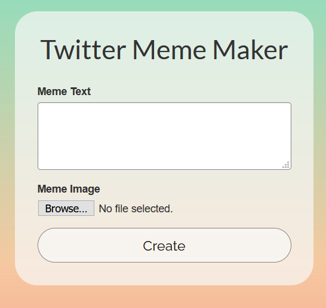

# Twitter Meme Maker

website: <a href="http://osmanyc.pythonanywhere.com">osmanyc.pythonanywhere.com</a>

Twitter Meme Maker lets you make Twitter-style memes without needing to have a Twitter. It gives you the perfect image crop, all you need is an image and some text.

This website is written in Flask, with a custom frontend using mostly jQuery.

